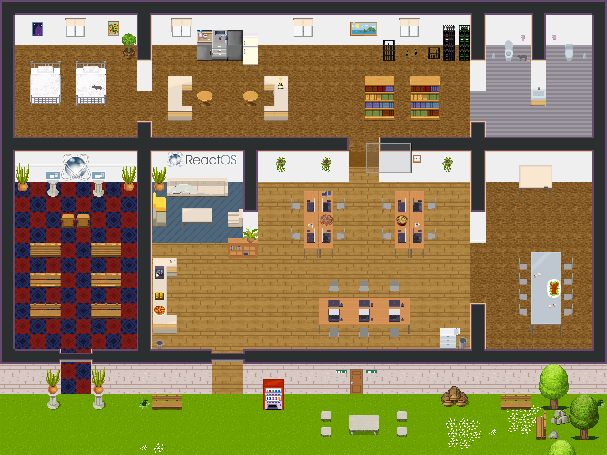

# ReactOS Head Office (based on WorkAdventure Map Starter Kit)



## Installation

With npm installed (comes with [node](https://nodejs.org/en/)), run the following commands into a terminal in the root directory of this project:

```shell
npm install
npm run start
```

The project will run at http://localhost:8080/

## Licenses

This project contains multiple licenses as follows:

* [Code license](./LICENSE.code) *(all files except those for other licenses)*
* [Map license](./LICENSE.map) *(`map.json` and the map visual as well)*
* [Assets license](./LICENSE.assets) *(the files inside the `src/assets/` folder)*
